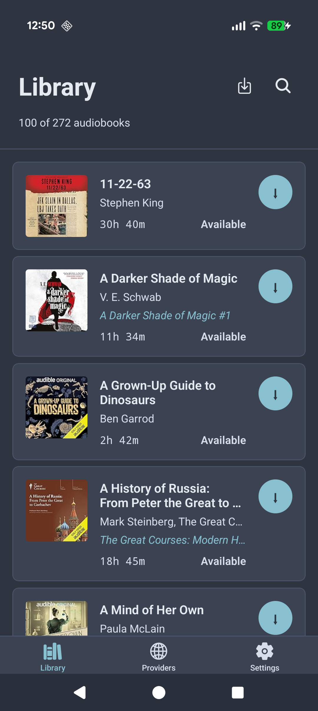
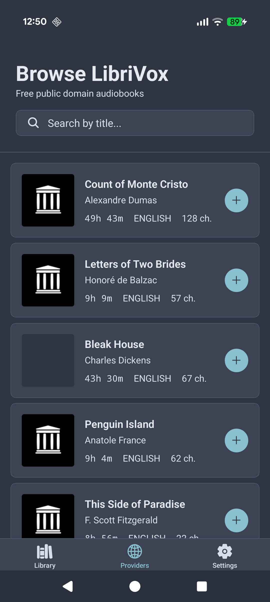
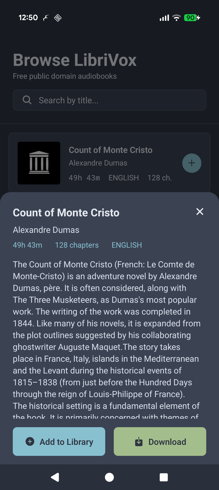
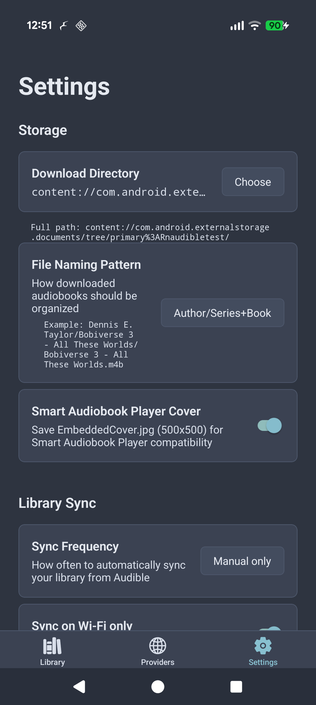

# LibriSync

Manage your audiobook library. Browse free LibriVox books and sync your Audible collection.

**[henning.tech/librisync](https://henning.tech/librisync)** · 

[//]: # ([Google Play]&#40;https://play.google.com/store/apps/details?id=tech.henning.librisync&#41;)

## Features

**Browse & Download Free Audiobooks**
Discover thousands of free public domain audiobooks from LibriVox — no account required. Search by title or author, and download directly to your device.

**Sync Your Audible Library**
Connect your Audible account to sync your purchased audiobooks. View your entire library with cover art, series info, and duration details.

**Download & Listen Offline**
Background downloads with progress notifications, pause/resume support, and automatic retry on failure.

**Smart File Organization**
Choose how your audiobooks are organized on your device — flat files, Author/Book, or Author/Series/Book folders. Compatible with Smart Audiobook Player for seamless cover art integration.

**Export Your Library**
Export your audiobook collection to CSV, JSON, XLSX, TXT, or PNG. Sort by name or length, group by author or series, and copy formatted text to clipboard.

**Privacy First**
No tracking. No analytics. No ads. No accounts required for LibriVox browsing. All data stays on your device.

## Screenshots

<p align="center">
  
  
  
  
</p>

## Installation

[//]: # (**Google Play**: [Download from Google Play]&#40;https://play.google.com/store/apps/details?id=tech.henning.librisync&#41;)

**GitHub Releases**: Download the latest APK from [Releases](https://github.com/Promises/LibriSync/releases)

---

## Development

LibriSync is built with React Native (TypeScript) and a Rust core library — a direct port of [Libation](https://github.com/rmcrackan/Libation)'s C# codebase.

### Architecture

```
┌─────────────────────────────┐
│   React Native / TypeScript │  UI Layer
├─────────────────────────────┤
│   JNI (Android) / FFI (iOS) │  Native Bridge
├─────────────────────────────┤
│   libaudible (Rust)         │  Core Library
└─────────────────────────────┘
```

The Rust core (`native/rust-core/`) is a 1:1 translation of Libation's C# source, maintaining the same architecture, data models, and business logic.

### Prerequisites

- **Node.js** >= 20.16.0
- **Rust** (`curl --proto '=https' --tlsv1.2 -sSf https://sh.rustup.rs | sh`)
- **Android**: Android Studio, SDK Platform 34, NDK 29, JDK 17+
- **iOS**: Xcode 15+, CocoaPods

```bash
# Android NDK
export ANDROID_NDK_HOME=$HOME/Library/Android/sdk/ndk/29.0.14033849

# Rust targets
rustup target add aarch64-linux-android armv7-linux-androideabi i686-linux-android x86_64-linux-android  # Android
rustup target add aarch64-apple-ios aarch64-apple-ios-sim                                                # iOS
```

### Quick Start

```bash
npm install

# Development (no Rust rebuild)
npm start                    # Expo dev server

# Full build with native code
npm run android              # Build Rust + Run Android
npm run ios                  # Build Rust + Run iOS
```

### Build Commands

```bash
# Rust only
npm run build:rust:android   # Android (all architectures)
npm run build:rust:ios       # iOS (device + simulator)
npm run test:rust            # Run Rust unit tests

# Docker release build
GIT_REPO=https://github.com/Promises/LibriSync.git \
BUILD_TYPE=release BUNDLE_TYPE=aab \
./docker-build.sh build
```

### Project Structure

```
src/                         # React Native UI
  screens/                   # Library, Browse, Settings
  styles/theme.ts            # Nord color theme
native/rust-core/            # Rust core library (libaudible)
  src/api/                   # Audible API, OAuth, library sync
  src/crypto/                # AAX/AAXC decryption
  src/storage/               # SQLite database layer
  src/download/              # Download manager
  src/audio/                 # Audio processing
modules/expo-rust-bridge/    # Native bridge (JNI + FFI)
scripts/                     # Build automation
plugins/                     # Expo config plugins
```

## License

**GNU General Public License v3.0** (GPL-3.0)

LibriSync is a Rust port of [Libation](https://github.com/rmcrackan/Libation) by Libation contributors. This derivative work maintains the GPL-3.0 license from the original project.

- **Original work**: Copyright (C) Libation contributors
- **Rust port**: Copyright (C) 2025 Henning Berge
